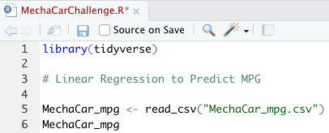

# MechaCar_Statistical_Analysis, Module 15 Challenge

A few weeks after starting his new role, Jeremy is approached by upper management about a special project. AutosRUs’ newest prototype, the MechaCar, is suffering from production troubles that are blocking the manufacturing team’s progress. AutosRUs’ upper management has called on Jeremy and the data analytics team to review the production data for insights that may help the manufacturing team.
In this challenge, you’ll help Jeremy and the data analytics team do the following:
Perform multiple linear regression analysis to identify which variables in the dataset predict the mpg of MechaCar prototypes
Collect summary statistics on the pounds per square inch (PSI) of the suspension coils from the manufacturing lots
Run t-tests to determine if the manufacturing lots are statistically different from the mean population
Design a statistical study to compare vehicle performance of the MechaCar vehicles against vehicles from other manufacturers. For each statistical analysis, you’ll write a summary interpretation of the findings.

## Deliverable 1

You will earn a perfect score for Deliverable 1 by completing all requirements below:
The MechaCar_mpg.csv file is imported and read into a dataframe (5 pt)

Resources
An RScript is written for a linear regression model to be performed on all six variables (10 pt)
An RScript is written to create the statistical summary of the linear regression model with the intended p-values (10 pt)
There is a summary that addresses all three questions (5 pt)

## Deliverable 2

You will earn a perfect score for Deliverable 2 by completing all requirements below:
The Suspension_Coil.csv file is imported and read into a dataframe (5 pt)
An RScript is written to create a total summary dataframe that has the mean, median, variance, and standard deviation of the PSI for all manufacturing lots (10 pt)
An RScript is written to create a lot summary dataframe that has the mean, median, variance, and standard deviation for each manufacturing lot (10 pt)
There is a summary that addresses the design specification requirement for all the manufacturing lots and each lot individually (5 pt)

## Deliverable 3

You will earn a perfect score for Deliverable 3 by completing all requirements below:
An RScript is written for t-test that compares all manufacturing lots against mean PSI of the population (5 pt)
An RScript is written for three t-tests that compare each manufacturing lot against mean PSI of the population (10 pt)
There is a summary of the t-test results across all manufacturing lots and for each lot (5 pt)

## Deliverable 4

You will earn a perfect score for Deliverable 4 by completing all requirements below:
The statistical study design has the following:
A metric to be tested is mentioned (5 pt)
A null hypothesis or an alternative hypothesis is described (5 pt)
A statistical test is described to test the hypothesis (5 pt)
The data for the statistical test is described (5 pt)