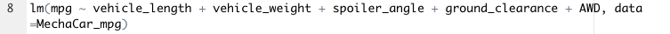
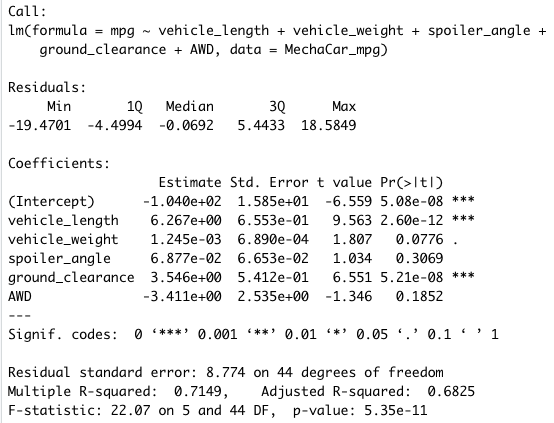
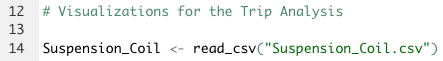
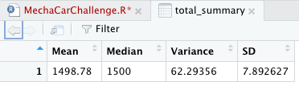
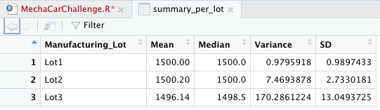
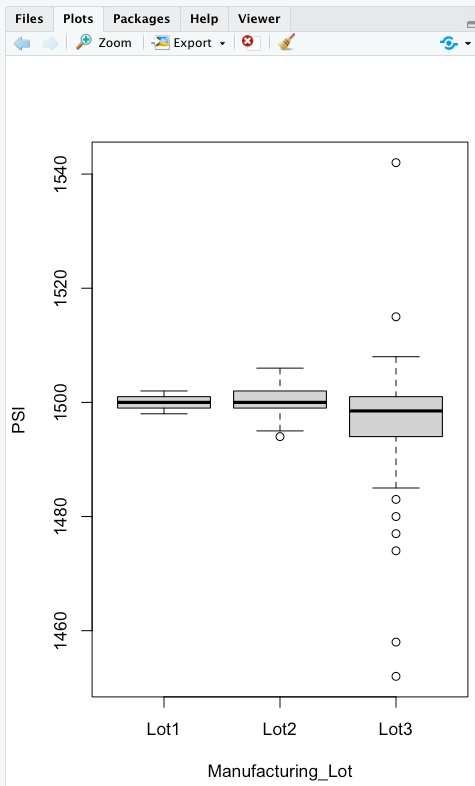
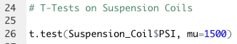
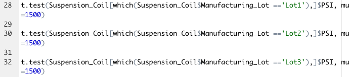
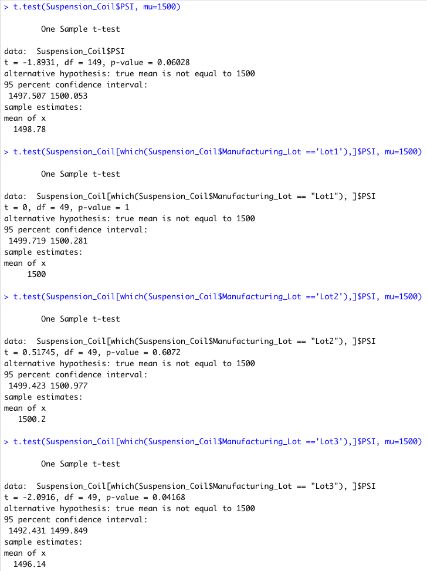

# MechaCar_Statistical_Analysis, Module 15 Challenge

The "MechaCar_Statistical_Analysis" will do the following:

* Perform multiple linear regression analysis to identify which variables in the dataset predict the mpg of MechaCar prototypes
* Collect summary statistics on the pounds per square inch (PSI) of the suspension coils from the manufacturing lots
* Run t-tests to determine if the manufacturing lots are statistically different from the mean population
* Design a statistical study to compare vehicle performance of the MechaCar vehicles against vehicles from other manufacturers

## Deliverable 1

The MechaCar_mpg.csv file is imported and read into a dataframe.

An R script is written for a linear regression model to be performed on all six variables.

An R script is written to create the statistical summary of the linear regression model with the intended p-values.

### Model Summary

* Coefficients and Intercept

mpg =   **6.267 vehicle_length** +
        0.001 vehicle_weight +
        0.068 spoiler_angle +
        **3.546 ground_clearance** -
        **3.411 AWD** -
        104

* p-values

The values under 0.05 are:

5.1e-08 for the intercept
2.6e-12 for vehicle_length
5.2e-12 for ground_clearance

According to the above, vehicle_length, ground_clearance, and the intercept are statistically unlikely to provide random amounts of variance to the linear model. Or, the vehicle_length, and ground_clearance have a significant impact on the vehicle's fuel consumption (mpg).

R-squared for this model is 0.71, so approximately 71% of all mpg predictions will be determined by this model.

## Deliverable 2

The Suspension_Coil.csv file is imported and read into a dataframe.

An R script is written to create a total summary dataframe that has the mean, median, variance, and standard deviation of the PSI for all manufacturing lots.

An R script is written to create a lot summary dataframe that has the mean, median, variance, and standard deviation for each manufacturing lot.

### Summary Statistics on Suspension Coils

The design specification for the MechaCar suspension coils dictates that the variance of the suspension coils must not exceed 100 pounds per square inch (PSI).

The variance for the entire production (all lots) is 62.3 (and a SD of 7.8), as per this metric, all coils are within the 100 psi range.

But analyzing each lot, Lots 1 and 2 have variances of 0.9 and 7.4 respectively, while Lot 3 is at 170.2, well outside the 100 psi limit established as the acceptance level.

The following figure shows clearly that lot 3 has many outliers, both above and under the design pressure of 1500 psi.

## Deliverable 3

An R script is written for t-test that compares all manufacturing lots against mean PSI of the population.

An R script is written for three t-tests that compare each manufacturing lot against mean PSI of the population.

Summary of the t-test results across all manufacturing lots and for each lot:

* For the entire production, the mean is 1498.78 psi, with a p-value is 0.06. This is greater than the common significance level of 0.05, so there is not enough evidence to support rejecting the null hypothesis
* Lot 1 has the mean at exactly 1500 psi, with a p-value of 1. We cannot reject the null hypothesis
* Lot 2 has the mean at 1500.2 and the p-value at 0.6. Like above, we cannot reject the null hypothesis
* Lot 3 has the mean at 1496.14 psi, and the p-value t 0.04, which is lower than the common significance level of 0.05; indicating to reject the null hypothesis that this sample mean and the presumed population mean are not statistically different

## Deliverable 4, Study Design: MechaCar vs Competition

The "**braking distance**", in feet, refers to the distance a vehicle will travel from the point when its brakes are fully applied to when it comes to a complete stop[^1]. It is primarily affected by:
1. the original speed of the vehicle, and
2. the coefficient of friction between the tires and the road surface

* Metrics to be tested

The following variables will be analyzed:

Independent variable: braking distance.

Dependent variables: original vehicle speed, coefficient of friction between the tires and the road surface, vehicle weight, tires pressure, road condition (wet or dry).

* Null hypothesis

H0: Braking distance is not affected by the vehicle's original speed

* Statistical test to test the hypothesis

The "multiple linear regression" uses multiple independent variables to account for parts of the total variance observed in the dependent variable, which is our case. The r-squared value of the model will be used to determine if the model sufficiently predicts the dependent variable.

* Data for the statistical test

Original vehicle speed: this can be easily set and changed to obtain a wide range of values. The following could be used as reference: 20, 30, 40, 50, 60, 70 and 80 mph.

Coefficient of friction between the tires and the road surface: this is specific to the tire design and wear condition, against different road types.

Vehicle weight: this will depend on the vehicle type, similar weights will make possible to compare their braking distances.

Tires pressure: the four tires will need to be set at the same value for an accurate comparison. The pressure can be increased and decreased by 10 and 20% to see how the dependent variable changes.

Road condition (wet or dry): since the amount of water on the road has to be the same for a valid comparison, this would be better to be controlled in a track with accurate and constant water delivery onto the road.

[^1]: https://en.wikipedia.org/wiki/Braking_distance